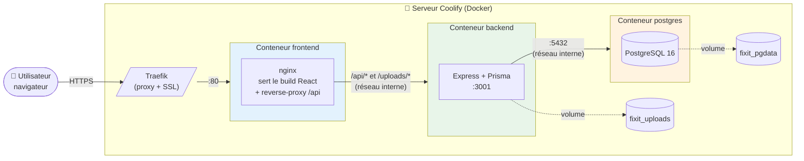
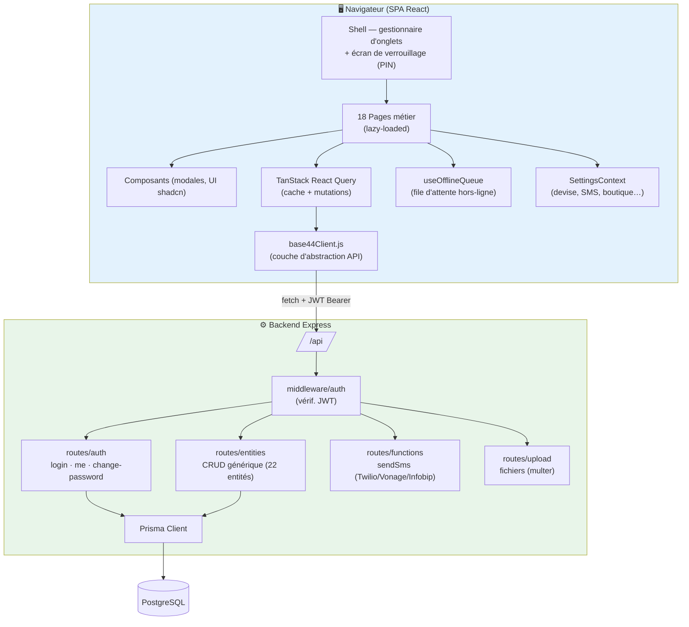
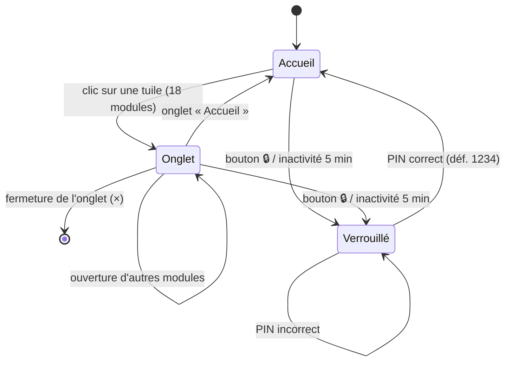

# 1. Architecture technique

[← Retour à l'index](README.md)

---

## 1.1 Vue macroscopique (3 tiers)

L'application suit une architecture **client lourd / API / base de données** classique, entièrement conteneurisée.



**Points clés :**
- Seul le conteneur **frontend (nginx)** est exposé publiquement. `backend` et `postgres` ne sont accessibles que sur le réseau interne Docker (pas de `ports:` publiés) — c'est Traefik/Coolify qui gère l'exposition externe.
- nginx joue **deux rôles** : servir les fichiers statiques du build Vite **et** relayer les appels `/api/` et `/uploads/` vers le backend via le DNS interne Docker (`http://backend:3001`).
- Deux volumes persistants : `fixit_pgdata` (données SQL) et `fixit_uploads` (fichiers téléversés).

---

## 1.2 Couches logicielles (composants)



### Le rôle pivot de `base44Client.js`

L'application a été exportée de la plateforme **Base44**. Pour la rendre autonome, tous les appels au SDK cloud d'origine ont été remplacés par un client local (`src/api/base44Client.js`) qui **conserve la même interface** (`base44.entities.X.create()`, `.list()`, `.filter()`…). Résultat : les 18 pages n'ont quasiment pas eu à être réécrites, seul le « tuyau » a changé.

Ce client expose 4 familles d'opérations :

| Famille | Méthodes | Cible backend |
|---------|----------|---------------|
| `entities.<Nom>` | `list, filter, get, create, update, delete` | `/api/entities/*` |
| `auth` | `me, login, logout, redirectToLogin` | `/api/auth/*` |
| `functions` | `invoke(name, data)` | `/api/functions/:name` |
| `integrations.Core` | `UploadFile({ file })` | `/api/upload` |

---

## 1.3 Navigation : un « bureau » à onglets

Particularité de l'UI : il n'y a **pas de barre latérale** classique. L'app se comporte comme un **système d'exploitation à onglets** (pensé pour le tactile / plein écran en boutique) :



- **Écran d'accueil** (`HomeScreen`) : grille de 18 tuiles colorées, une par module.
- **Onglets** : chaque module ouvert devient un onglet ; les pages sont **chargées à la demande** (`React.lazy`) pour accélérer le démarrage.
- **Verrouillage automatique** : après **5 minutes d'inactivité** (souris/clavier/tactile), un écran PIN bloque l'accès. PIN par défaut `1234`, stocké dans le navigateur (`localStorage`).

---

## 1.4 Authentification

- Connexion par **email + mot de passe** → le backend renvoie un **JWT** (signé avec `JWT_SECRET`).
- Le token est stocké dans `localStorage` (`fixit_token`) et envoyé en en-tête `Authorization: Bearer …` à chaque appel.
- **Toutes les routes** `/api/entities`, `/api/functions`, `/api/upload` exigent un JWT valide (middleware `requireAuth`).
- Mots de passe hachés avec **bcrypt** (coût 12).

> ⚠️ *Note de sécurité* : le stockage du JWT en `localStorage` et le PIN par défaut côté client font partie des points d'amélioration sécurité identifiés (voir le compte-rendu de sécurité).

---

## 1.5 Arborescence du dépôt (simplifiée)

```
Fixit/
├── src/                      # Frontend React
│   ├── api/base44Client.js   # Couche d'abstraction API
│   ├── components/           # Modales & UI par domaine (pos, repairs, services…)
│   ├── components/shell/     # Shell à onglets + écran d'accueil + verrouillage
│   ├── components/settings/  # SettingsContext (devise, SMS…)
│   ├── pages/                # 18 pages métier
│   └── hooks/                # useOfflineQueue…
├── backend/                  # API Node.js
│   ├── src/routes/           # auth · entities · functions · upload
│   ├── src/middleware/       # auth (JWT)
│   ├── src/seed.js           # Données de démonstration (idempotent)
│   └── prisma/               # schema.prisma + migrations
├── docker-compose.yml        # Stack 3 services
├── Dockerfile.frontend       # Build Vite → nginx
├── backend/Dockerfile        # Build backend + migrate + seed
└── nginx.conf                # Service statique + reverse-proxy
```

---

[← Retour à l'index](README.md) · [Suivant : Modèle de données →](02-MODELE-DONNEES.md)
