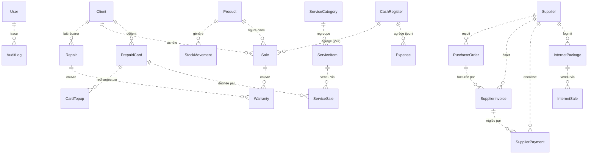
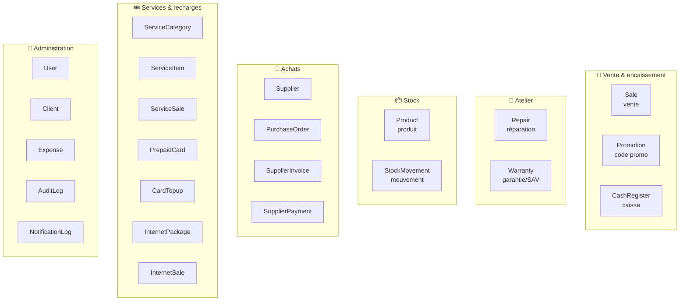

# 2. Modèle de données

[← Architecture](01-ARCHITECTURE.md) · [Index](README.md)

---

## 2.1 Remarque importante sur les relations

Le schéma (Prisma / PostgreSQL) compte **23 modèles**. Particularité héritée de l'origine Base44 : **il n'y a pas de clés étrangères formelles** entre les tables. Les liens sont **logiques**, matérialisés de deux façons :

1. **Par identifiant** : un champ `*_id` (texte) référence l'`id` d'une autre table (ex. `Repair` n'a pas de `client_id` mais stocke directement `client_name` + `client_phone`).
2. **Par dénormalisation** : beaucoup de tables recopient le *nom* de l'entité liée (`product_name`, `supplier_name`, `client_name`…) pour afficher l'historique sans jointure, même si l'entité d'origine change ensuite.

> Ce choix privilégie la simplicité de lecture et la résilience de l'historique au détriment de l'intégrité référentielle stricte. Les diagrammes ci-dessous montrent donc les relations **fonctionnelles**, pas des contraintes SQL.

---

## 2.2 Diagramme entité-relation (vue fonctionnelle)

---

## 2.3 Les domaines fonctionnels et leurs entités

---

## 2.4 Dictionnaire des entités

### 🛒 Vente & encaissement

| Entité | Rôle | Champs notables |
|--------|------|-----------------|
| **Sale** | Vente (produits/réparation/service) | `sale_number`, `type`, `client_name`, `items` (JSON), `subtotal`, `discount_total`, `total`, `payments` (JSON), `payment_method`, `status` (`completee`), `promo_code` |
| **Promotion** | Code promotionnel | `code` (unique), `type` (`pourcentage`…), `value`, `min_purchase`, `applicable_to`, `max_uses`, `current_uses`, `start_date`/`end_date`, `is_active` |
| **CashRegister** | Caisse journalière | `date`, `opening_balance`, `closing_balance`, `expected_balance`, `difference`, `total_cash_sales`, `total_card_sales`, `total_expenses`, `status` (`ouverte`/clôturée) |

### 🔧 Atelier

| Entité | Rôle | Champs notables |
|--------|------|-----------------|
| **Repair** | Dossier de réparation | `ticket_number`, `client_name`/`client_phone`, `device_type`/`brand`/`model`/`imei`/`password`, `problem_description`, `diagnosis`, `status` (9 valeurs), `priority`, `technician`, `estimated_cost`/`final_cost`/`deposit_amount`, `warranty_days`, `parts_used` (JSON), `payments` (JSON) |
| **Warranty** | Garantie / SAV | `type` (`vente`/`reparation`), `reference_number`, `client_name`, `product_name`, `start_date`/`end_date`, `status` (`active`…), `claim_description`, `resolution` |

### 📦 Stock

| Entité | Rôle | Champs notables |
|--------|------|-----------------|
| **Product** | Article d'inventaire | `name`, `sku`, `category`, `brand`/`model`, `buy_price`/`sell_price`, `quantity`, `min_stock`, `location`, `imei`/`serial_number`, `condition` (`neuf`…), `barcode`, `image_url`, `is_active` |
| **StockMovement** | Mouvement de stock | `product_id`/`product_name`, `type` (`entree`/`sortie`), `quantity`, `previous_stock`, `new_stock`, `reason`, `reference_type`/`reference_id` |

### 🚚 Achats / Fournisseurs

| Entité | Rôle | Champs notables |
|--------|------|-----------------|
| **Supplier** | Fournisseur | `name`, `contact_name`, `phone`/`email`/`address`, `payment_terms` (`comptant`/`30j`…) |
| **PurchaseOrder** | Commande d'achat | `order_number`, `supplier_id`/`supplier_name`, `items` (JSON), `total_amount`, `status` (`brouillon`…), `expected_date` |
| **SupplierInvoice** | Facture fournisseur | `invoice_number`, `supplier_*`, `invoice_date`/`due_date`, `total_amount`, `amount_paid`, `remaining_debt`, `status` (`en_attente`…), `payments` (JSON), `purchase_order_id` |
| **SupplierPayment** | Paiement fournisseur | `supplier_*`, `invoice_id`, `amount`, `amount_given`, `payment_method`, `payment_date` |

### 🎟️ Services & recharges

| Entité | Rôle | Champs notables |
|--------|------|-----------------|
| **ServiceCategory** | Catégorie de service | `name`, `description`, `color`, `icon`, `is_active` |
| **ServiceItem** | Prestation/service | `name`, `category_id`/`category_name`, `cost_price`/`sell_price`, `duration`, `is_active` |
| **ServiceSale** | Vente de service | `service_*`, `category_*`, `client_*`, `card_*`, `cost_price`/`sell_price`, `activation_code`, `amount`, `payment_method` |
| **PrepaidCard** | Carte prépayée | `code` (unique), `name`, `card_number`, `provider`, `currency`, `current_balance`, `total_loaded`/`total_spent`, `status` |
| **CardTopup** | Recharge de carte | `card_id`/`card_code`, `amount`, `old_balance`/`new_balance`, `payment_method` |
| **InternetPackage** | Forfait internet | `name`, `price`, `data_amount`, `validity_days`, `cost_price`/`sell_price`, `supplier_*`, `is_active` |
| **InternetSale** | Vente de forfait | `package_*`, `client_*`, `sell_price`/`cost_price`, `account_used`, `activation_code`, `profit`, `payment_method` |

### 👥 Administration & traçabilité

| Entité | Rôle | Champs notables |
|--------|------|-----------------|
| **User** | Compte utilisateur | `email` (unique), `password_hash`, `name`, `role` (déf. `admin`) |
| **Client** | Fiche client (CRM) | `full_name`, `phone`, `email`/`address`, `segment` (`particulier`/`professionnel`), `credit_balance`, `is_blacklisted`, `loyalty_points`, `notes` |
| **Expense** | Dépense / charge | `description`, `amount`, `category`, `payment_method`, `date` |
| **AuditLog** | Journal d'audit | `user_name`, `action`, `entity_type`/`entity_id`, `old_data`/`new_data` (JSON), `ip_address` |
| **NotificationLog** | Journal de notifications | `type`, `recipient`, `message`, `status`, `error`, `reference_type`/`reference_id` |

---

## 2.5 Champs communs à toutes les tables

| Champ | Type | Description |
|-------|------|-------------|
| `id` | UUID | Clé primaire générée automatiquement |
| `created_date` | DateTime | Horodatage de création (défaut : maintenant) |
| `updated_date` | DateTime | Horodatage de dernière modification (auto) |

---

[← Architecture](01-ARCHITECTURE.md) · [Index](README.md) · [Suivant : Flux métier →](03-FLUX-METIER.md)
