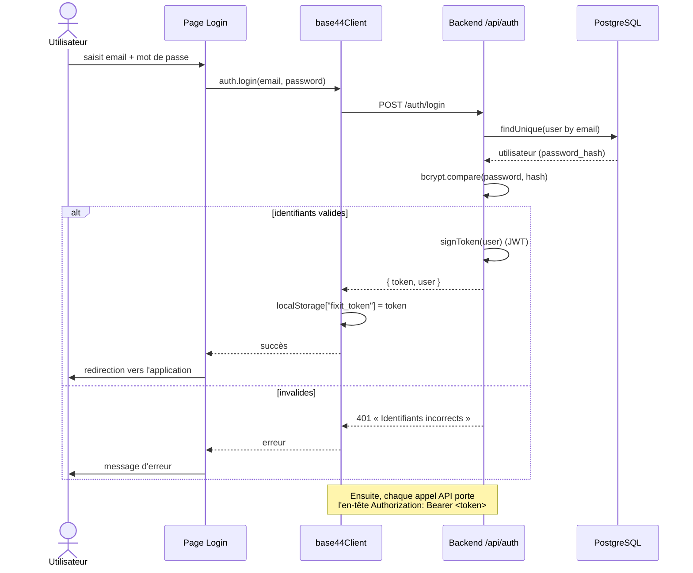
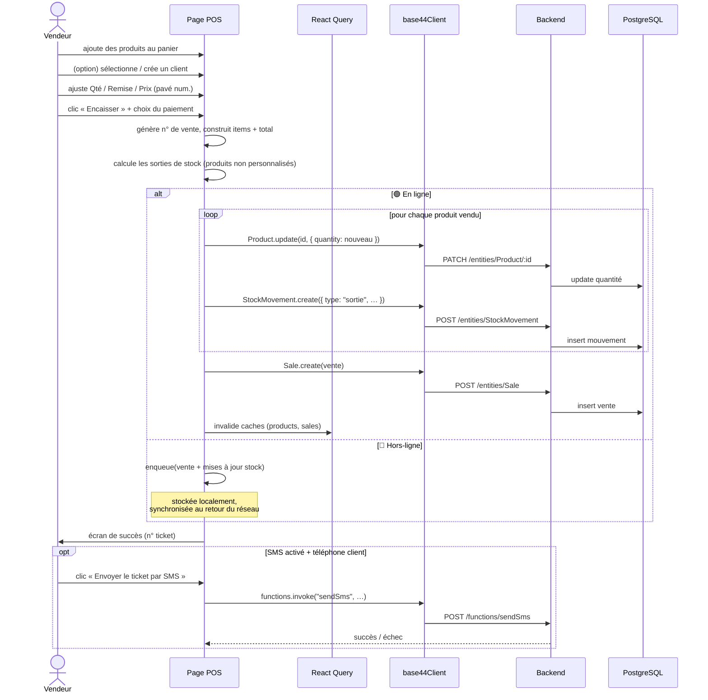
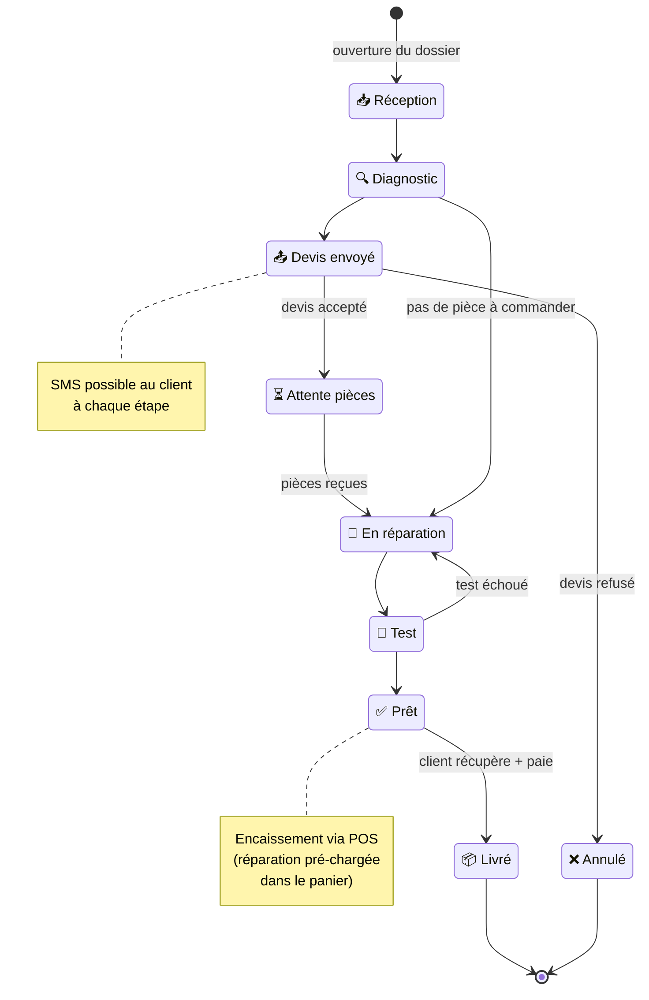
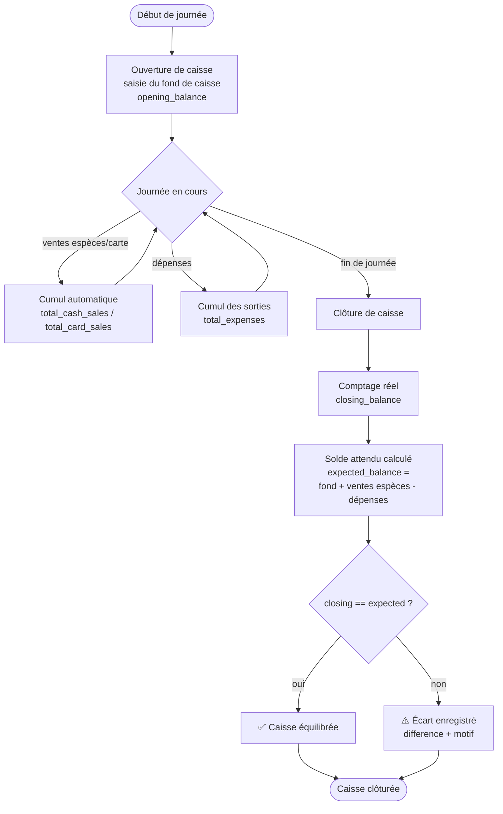
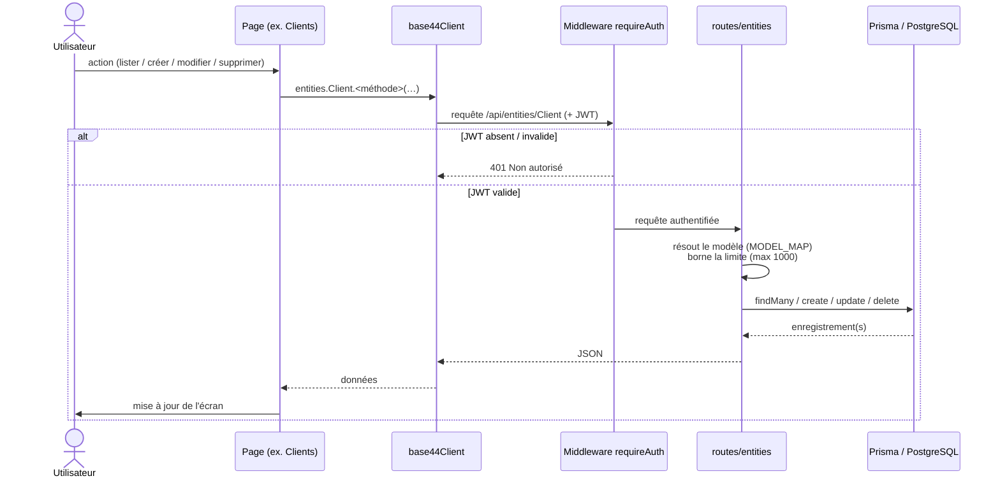
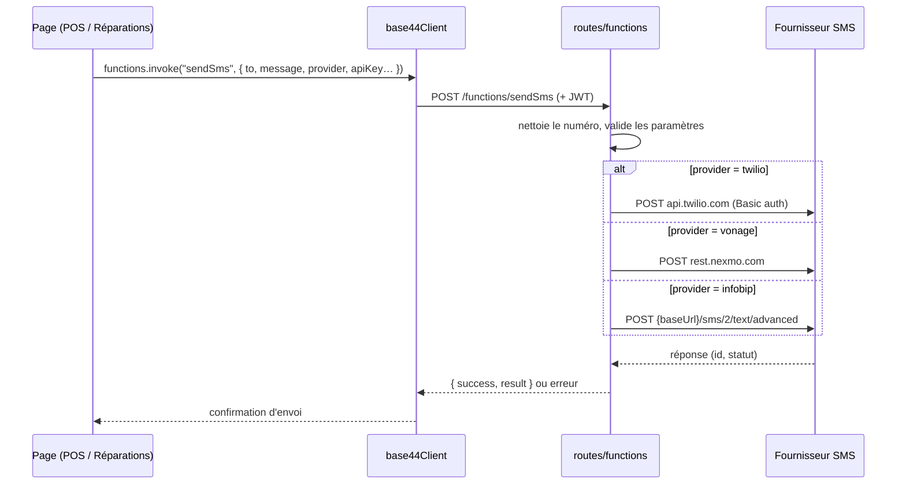
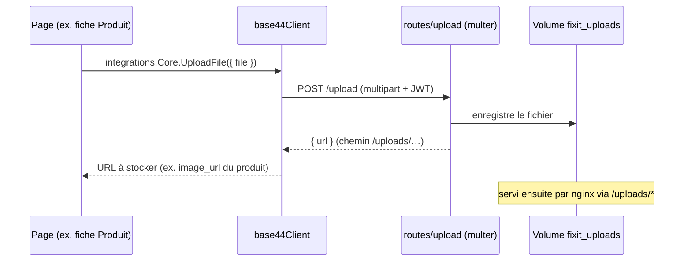

# 3. Flux métier (diagrammes de séquence & d'activité)

[← Modèle de données](02-MODELE-DONNEES.md) · [Index](README.md)

---

## 3.1 Authentification (séquence)

---

## 3.2 Vente au point de vente (POS) — le flux central

Le POS gère **plusieurs tickets en parallèle**, un panier par ticket, un pavé numérique tactile (modes **Qté / Remise / Prix**), la sélection du client, et un **mode hors-ligne**.

**À retenir :**
- Une vente **décrémente le stock** des produits et **trace un mouvement** `sortie` pour chaque article (référence = n° de ticket).
- Les articles « personnalisés » (réparation/service pré-chargés, prix libre) **n'affectent pas le stock**.
- Le **mode hors-ligne** met la vente en file d'attente (`useOfflineQueue`) et la rejoue automatiquement au retour de la connexion — utile en boutique avec un réseau instable.

---

## 3.3 Cycle de vie d'une réparation (activité)

Une réparation passe par **9 statuts**. Le client peut être notifié par SMS à chaque changement, et le règlement final se fait au POS.

**Passerelle Réparation → Caisse :** depuis un dossier « Prêt », l'application peut ouvrir le POS avec la réparation **déjà dans le panier** (via un paramètre d'URL `?preload=repair:…`), pré-remplissant le libellé, le prix et le client. Une garantie (`Warranty`) peut être générée à la livraison (`warranty_days`).

---

## 3.4 Ouverture & clôture de caisse (activité)

---

## 3.5 CRUD générique des entités (séquence)

Toutes les pages (Clients, Produits, Fournisseurs…) partagent **le même mécanisme** d'accès aux données, grâce à la route générique du backend.

**Détails techniques :**
- Une **table de correspondance** (`MODEL_MAP`) autorise 22 entités ; toute autre est rejetée (404). Cela évite l'accès arbitraire à des tables internes.
- Le nombre de résultats est **plafonné à 1000** (`MAX_TAKE`) pour éviter les requêtes massives.
- Tri par défaut : `created_date` décroissant. Les filtres supportent les opérateurs `gte`, `lte`, `contains`…
- Les champs `id`, `created_date`, `updated_date` sont **protégés** (ignorés en création/modification).

---

## 3.6 Envoi de SMS (séquence)

Le backend agit comme **passerelle multi-fournisseurs** : il relaie le message vers le service configuré dans les paramètres.

> Les SMS servent à deux usages : **ticket de caisse** (POS) et **notification de réparation** (changement de statut). Les modèles de message sont personnalisables dans les paramètres (variables `{numero}`, `{client}`, `{total}`, `{articles}`…).

---

## 3.7 Téléversement de fichier (séquence)

---

[← Modèle de données](02-MODELE-DONNEES.md) · [Index](README.md) · [Suivant : Catalogue fonctionnel →](04-CATALOGUE-FONCTIONNEL.md)
