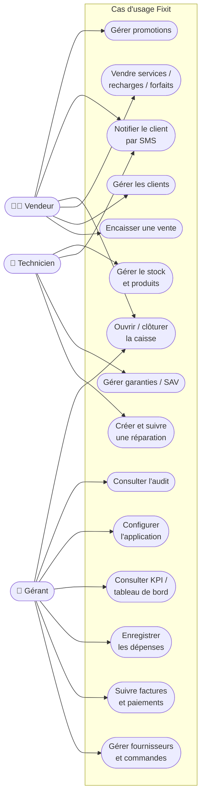
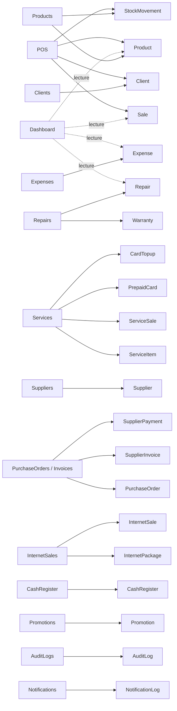

# 4. Catalogue fonctionnel

[← Flux métier](03-FLUX-METIER.md) · [Index](README.md)

---

## 4.1 Diagramme de cas d'usage

> ⚠️ **Note sur les rôles** : techniquement, l'application ne gère qu'**un seul rôle** (`admin`) — tous les utilisateurs connectés ont accès à tout. Les « acteurs » ci-dessous représentent les **casquettes fonctionnelles** d'une boutique (souvent portées par les mêmes personnes), pas des permissions distinctes dans le logiciel.

---

## 4.2 Les 18 modules en détail

### 🖥️ POS — Caisse (point de vente)
Le module le plus riche. Interface tactile plein écran pour encaisser rapidement.
- **Multi-tickets** : plusieurs ventes en cours simultanément (clients différents).
- **Panier** avec pavé numérique : modes **Quantité**, **Remise (%)**, **Prix** libre.
- **Recherche produits** par nom + filtres par catégorie (téléphones, PC, accessoires, pièces…).
- **Client** : sélection dans la base, création rapide, ou « client comptoir » anonyme.
- **Paiements** : espèces, carte… (méthode enregistrée sur la vente).
- **Décrémentation auto du stock** + traçabilité (`StockMovement`).
- **Mode hors-ligne** : file d'attente locale, synchronisation au retour réseau.
- **Ticket SMS** envoyé au client après encaissement.
- **Pré-chargement** d'une réparation ou d'un service à encaisser (via lien).

### 📊 Dashboard — Tableau de bord
Vue de pilotage à l'ouverture de l'app.
- **KPI** : chiffre d'affaires, nombre de ventes, réparations actives, produits en stock faible.
- **Graphe** du chiffre d'affaires sur 7 jours.
- **Répartition des réparations** par statut.

### 👥 Clients — CRM
- Fiche client : coordonnées, **segment** (particulier / professionnel), adresse, notes.
- **Solde de crédit** (`credit_balance`), **points de fidélité**.
- **Liste noire** (`is_blacklisted`) pour les mauvais payeurs.

### 🛒 Sales — Historique des ventes
- Liste de toutes les ventes (produits, réparations, services).
- Consultation du détail (articles, total, paiement, client).

### 🎟️ Services — Prestations & recharges
Module composite gérant plusieurs sous-domaines :
- **Catégories de services** et **prestations** (prix de revient / prix de vente).
- **Ventes de services** (avec code d'activation éventuel).
- **Cartes prépayées** : solde, recharges (`CardTopup`), suivi chargé/dépensé.

### 💵 CashRegister — Registre de caisse
- **Ouverture** : saisie du fond de caisse.
- **Cumuls automatiques** : ventes espèces, ventes carte, dépenses.
- **Clôture** : comptage réel, solde attendu, **écart** et motif.

### 🏷️ Promotions
- Codes promo : **pourcentage** ou montant, achat minimum, cible, plafond d'utilisations, période de validité, activation/désactivation.

### 🔧 Repairs — Atelier de réparation
- Dossier complet : appareil (type/marque/modèle/IMEI/**mot de passe**), problème, diagnostic.
- **9 statuts** de workflow + **priorité** + technicien assigné.
- Coûts : estimé / final / **acompte**, pièces utilisées, paiements.
- **Notification SMS** du client, durée de garantie, **suppression contrôlée** (avec confirmation).

### 🛡️ Warranties — Garanties & SAV
- Garanties issues d'une **vente** ou d'une **réparation**.
- Période de validité, statut, description de réclamation et résolution.

### 📦 Products — Inventaire
- Catalogue produits : SKU, catégorie, marque/modèle, **prix d'achat / vente**, quantité, **seuil mini**, emplacement, IMEI/n° de série, état (neuf/occasion…), code-barres, image.
- Édition de la quantité → **génère automatiquement un mouvement de stock**.

### 🏭 StockMovements — Mouvements de stock
- Journal des **entrées / sorties** : produit, quantité, stock avant/après, motif, référence (vente, commande…).
- Traçabilité complète de l'inventaire.

### 🚚 Suppliers — Fournisseurs
- Fiche fournisseur : contact, coordonnées, **conditions de paiement** (comptant, 30j, 60j…).

### 🧾 PurchaseOrders — Commandes d'achat
- Bons de commande : articles, montant total, statut (brouillon…), date prévue.

### 📄 SupplierInvoices — Factures fournisseurs
- Factures : montant, **payé / reste dû**, échéance, statut, **paiements** rattachés, lien vers la commande.

### 🧮 Expenses — Dépenses & charges
- Saisie des charges : description, montant, catégorie, mode de paiement, date.
- Alimente les cumuls de caisse et le tableau de bord.

### 🌐 InternetSales — Forfaits internet
- **Forfaits** (volume de données, validité, prix d'achat/vente, fournisseur) et leur **gestion (CRUD)**.
- **Ventes de forfaits** avec calcul de la **marge** et code d'activation.

### 📜 AuditLogs — Journal d'audit
- Traçabilité des actions : utilisateur, action, type/identifiant d'entité, données avant/après, adresse IP.

### 🔔 Notifications
- Journal des notifications envoyées (SMS…) : type, destinataire, message, statut, erreurs éventuelles.

### ⚙️ Settings — Paramètres
- **Boutique** : nom, coordonnées (utilisés dans les tickets/SMS).
- **Devise** : par défaut **TND (Dinar tunisien, « DT »)** — source de vérité de tout le formatage monétaire.
- **SMS** : fournisseur (Twilio / Vonage / Infobip), clés API, modèles de message.
- **Sécurité** : code PIN de verrouillage, changement de mot de passe.

---

## 4.3 Récapitulatif : module → entités manipulées

---

## 4.4 Synthèse des capacités

| Domaine | L'application **permet** de… |
|---------|------------------------------|
| **Vente** | Encaisser en multi-tickets, appliquer remises/promos, vendre hors-ligne, envoyer le ticket par SMS |
| **Atelier** | Suivre une réparation sur 9 étapes, notifier le client, gérer acomptes & garanties, encaisser au POS |
| **Stock** | Tenir l'inventaire, tracer chaque mouvement, alerter sur les seuils bas |
| **Achats** | Gérer fournisseurs, commandes, factures et règlements (suivi de la dette) |
| **Services** | Vendre prestations, cartes prépayées + recharges, forfaits internet avec marge |
| **Finance** | Ouvrir/clôturer la caisse avec contrôle d'écart, suivre dépenses et CA |
| **Pilotage** | Consulter KPI temps réel, audit des actions, notifications |
| **Configuration** | Personnaliser boutique, devise, passerelle SMS, sécurité |

---

[← Flux métier](03-FLUX-METIER.md) · [Retour à l'index](README.md)
