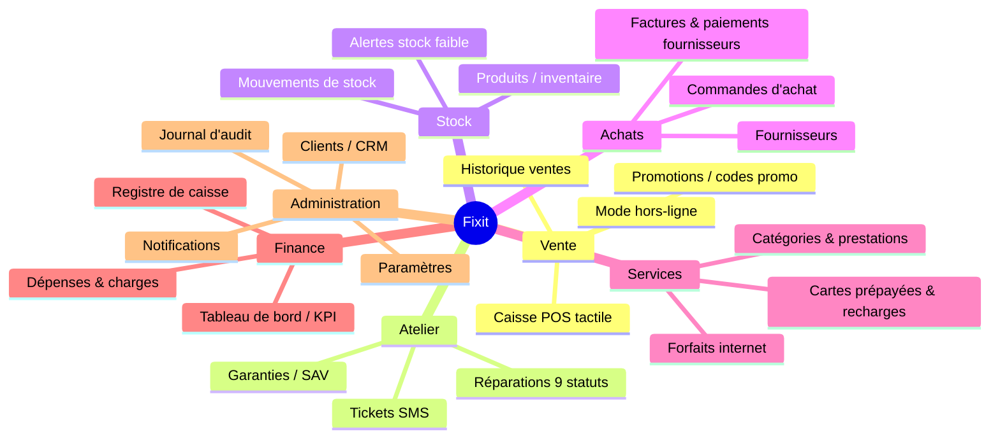

# 📚 Documentation Fixit — Logiciel de gestion d'atelier de réparation & vente

> Documentation technique et fonctionnelle reconstituée par **reverse engineering** du code source.
> Application destinée à une boutique de réparation/revente de téléphones & ordinateurs (contexte franco-tunisien).

---

## 🎯 En une phrase

**Fixit** est un logiciel de caisse et de gestion tout-en-un (POS + atelier + stock + CRM + comptabilité légère) fonctionnant dans le navigateur, conçu pour une utilisation tactile en boutique, avec un backend auto-hébergé (Node.js + PostgreSQL).

---

## 🗂️ Plan de la documentation

| # | Document | Contenu |
|---|----------|---------|
| 1 | [Architecture technique](01-ARCHITECTURE.md) | Stack, déploiement Docker/Coolify, diagramme de composants, couches logicielles |
| 2 | [Modèle de données](02-MODELE-DONNEES.md) | Les 23 entités, diagramme entité-relation, description des champs |
| 3 | [Flux métier](03-FLUX-METIER.md) | Diagrammes de séquence & d'activité (vente POS, réparation, caisse, auth, SMS…) |
| 4 | [Catalogue fonctionnel](04-CATALOGUE-FONCTIONNEL.md) | Les 18 modules détaillés + diagramme de cas d'usage |

> 💡 Tous les diagrammes sont en **Mermaid** : ils s'affichent automatiquement sur GitHub et dans la plupart des éditeurs Markdown (VS Code avec extension Mermaid, Obsidian, etc.).

---

## 🧭 Vue d'ensemble express

---

## ⚙️ Stack technique en bref

- **Frontend** : React 18 · Vite 6 · TanStack Query · shadcn/ui (Radix + Tailwind) · lucide-react
- **Backend** : Node.js · Express · Prisma ORM · JWT (bcrypt)
- **Base de données** : PostgreSQL 16
- **Serveur web** : nginx (sert le build + reverse-proxy `/api`)
- **Déploiement** : Docker Compose (3 services) → Coolify v4 (proxy Traefik + SSL auto)

---

## 🔑 Accès par défaut

| Paramètre | Valeur (configurable via variables d'environnement) |
|-----------|------------------------------------------------------|
| Email admin | `ADMIN_EMAIL` (défaut `admin@fixit.local`) |
| Mot de passe | `ADMIN_PASSWORD` |
| Code PIN verrouillage écran | `1234` (modifiable, stocké côté navigateur) |

---

*Documentation générée le 19/06/2026 — branche `drphone`.*
